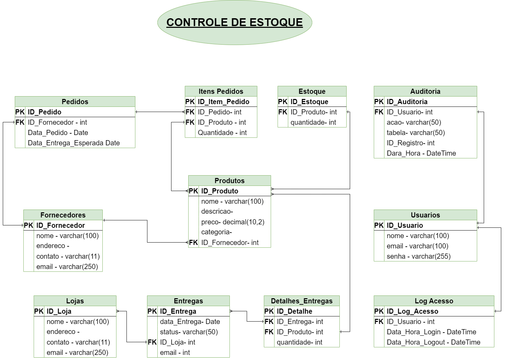
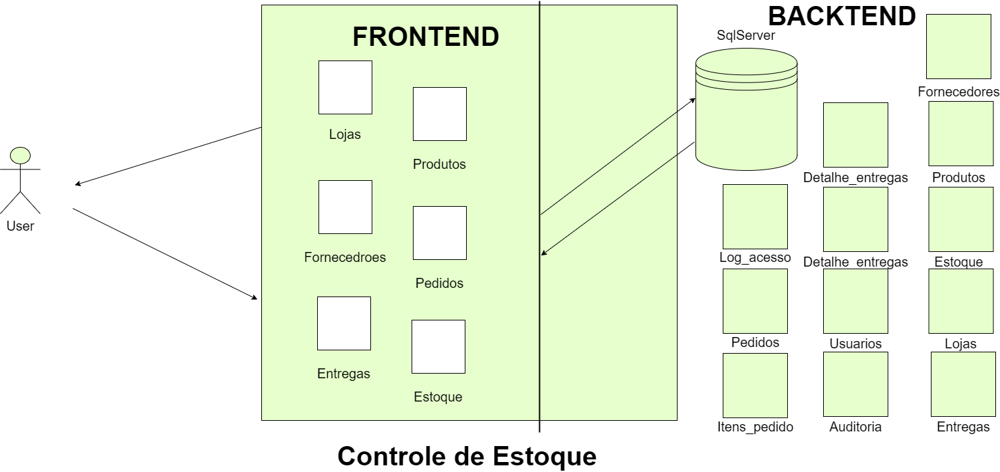

# Controle de Estoque

Este projeto tem como objetivo desenvolver um sistema de controle de estoque para uma distribuidora de móveis. O relatório a seguir documenta o processo de desenvolvimento, os desafios enfrentados, as soluções adotadas e as conclusões alcançadas ao longo do projeto.

## Descrição Geral do Projeto

### Base de Dados do Sistema

### Desenho da Solução

## Objetivos do Projeto

O principal objetivo do projeto Controle de Estoque era desenvolver uma aplicação que permitisse a gestão eficiente do estoque da empresa, melhorando sua eficiência operacional e proporcionando uma melhor experiência para os clientes.

## Metodologia

O projeto foi desenvolvido seguindo uma metodologia ágil.

## Desenvolvimento

A fase de desenvolvimento do projeto Controle de Estoque tem sido uma jornada de aprendizado constante. A linguagem Visual Basic, embora nova para mim, tem se mostrado uma ferramenta poderosa. Estou no processo de aprender e entender suas nuances, e já consegui fazer um bom progresso.

## Funcionalidades

### Gestão de Lojas

Permite o cadastro e consulta de lojas, que são os “clientes” para onde as entregas serão destinadas. É possível editar e atualizar dados das lojas.

### Gestão de Produtos

Permite o cadastro de produtos associando-os aos respectivos fornecedores, categoria, quantidade e preço. Também permite a consulta de produtos, com a possibilidade de filtrar a consulta por nome, preço, categoria ou fornecedor, além de editar, atualizar ou eliminar um produto.

### Gestão de Fornecedores

Permite o cadastro e consulta de fornecedores, com a possibilidade de filtrar por produto, além de editar, atualizar ou eliminar um fornecedor.

### Controle de Pedidos

Permite o cadastro de pedidos com o respectivo fornecedor, produto, quantidade, data do pedido, data de entrega e o status da entrega. Também permite a consulta dos pedidos e filtrá-los por fornecedor, produto e período, bem como editar, atualizar ou eliminar um pedido.

## Funcionalidades Pendentes

- Controle de Entregas
- Controle de Estoque
- Relatórios

## Resultado

Até o momento e possível cadastrar e consultar Lojas, Produtos, Fornecedores e Pedidos, com exceção dos Pedidos, todas as consultas são feitas com filtros, E necessário corrigir / acrescentar função para editar/excluir. *Verificar funcionalidades pendentes a serem inseridas no código.

## Conclusão

Em resumo, o projeto Controle de Estoque tem sido uma jornada de aprendizado com Visual Basic, ASP.NET e SQL Server. Ainda há funcionalidades em desenvolvimento, mas o progresso até agora é encorajador. Continuo comprometido com o desenvolvimento do sistema.

## Próximos Passos

Implementação das funcionalidades pendentes, verificação e otimização das funcionalidades implementadas.

